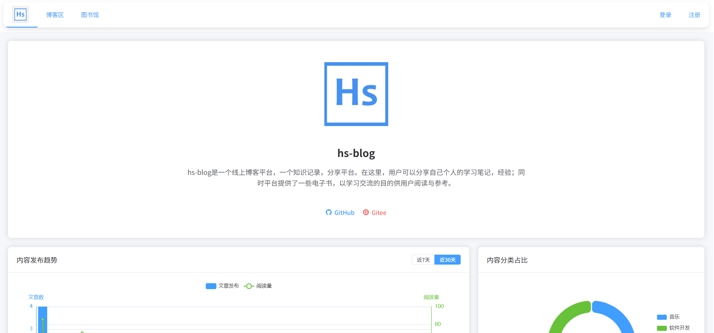

# HS-Blog 博客系统

# 📝 项目简介

hs-blog是一个线上博客平台，一个知识记录，分享平台。在这里，用户可以分享自己个人的学习笔记，经验；同时平台提供了一些电子书，以学习交流的目的供用户阅读与参考。

# 

### 🔗 项目地址

**本项目hs-blog**

**Github:** <a href="https://github.com/ZinniaHS/hs-blog" class="github-link">hs-blog</a>

**Gitee:** **（待补充）**

**客户端在线体验:** <a href="http://119.29.233.24/user/">hs-blog线上体验</a>

# 

**hs-blog-user-vue**

**客户端的前端:** <a href="https://github.com/ZinniaHS/hs-blog-user-vue">hs-blog-user-vue</a>

# 

**hs-blog-admin-vue**

**管理员端的前端:** <a href="https://github.com/ZinniaHS/hs-blog-admin-vue">hs-blog-admin-vue</a>

#

**项目技术栈：**

**后端：** Springboot, MybatisPlus, MySQL, Spring Security, JWT, Redis, Aliyun OSS

**前端：** Vue3+ElementPlus

**IDE：** IDEA, WebStorm

**本项目分为两端：管理员端，客户端。**

**管理员端：**

* 管理员登录
* 博客的查询，审核，锁定，删除
* 博客分类的增删改查。
* 图书的增删改查。
* 图书分类的增删改查。

**客户端：**

* 访客可以注册登录
* 用户可以写博客，查询博客，收藏博客，博客评论（待完成）
* 关注博主，获取关注博主的文章
* 查询图书，下载图书，加入我的书架

#

### 📸 整体效果

#

# 从零开始开发项目

首先，我先感谢愿意看我详细讲解项目的朋友们，如果你觉得这是一个不错的项目，或者以下的教程有哪些地方帮助到了你，希望你能够不吝给我点一个star，你的star是对我的最大鼓励！

## 软件开发流程

在项目开始之前，我们应该先复习回顾一下软件工程导论，了解一个项目的开发流程应该是怎么样的，这有助于我们从大方向上把握一个项目的方向。

大致来说，软件开发可以分为这么一些流程：**问题定义-> 可行性研究 -> 需求分析 -> 软件设计（总体设计，详细设计） -> 程序编码 -> 测试（单元测试，集成测试） -> 运行上线 -> 维护。接下来会以本项目为例，来说明一下各个流程是怎么进行的。

**1. 问题定义，可行性研究**

首先要确定解决什么问题，并且有什么样的解决方法能行得通的？本项目是一个集合博客功能的知识记录，分享平台，旨在通过实战项目提高编程水平，并且可以通过这个博客系统记录自己的学习历程。可行性方面在编程角度是完全可行的。

**2. 需求分析**

为了搭建一个知识记录，分享平台，系统应该做什么，要确定系统必须具备哪些功能。

本项目分为供管理员管理的管理端和用户使用的客户端。管理员可以通过管理端对用户账号进行管理，用户发布的博客进行管理，同时上传图书信息等功能。用户可以通过平台发布自己的博客，并且下载图书进行学习交流。

**管理员端：**

* 管理员登录
* 博客的查询，审核，锁定，删除
* 博客分类的增删改查。
* 图书的增删改查。
* 图书分类的增删改查。

**客户端：**

* 访客可以注册登录
* 用户可以写博客，查询博客，收藏博客，博客评论（待完成）
* 关注博主，获取关注博主的文章
* 查询图书，下载图书，加入我的书架

从上面这些点来看，我们能大概了解到两个平台应该完成什么事情。

**3. 软件设计，程序编码**

本项目是一个线上网站，使用前后端分离模式开发，前端使用Vue3+ElementPlus，后端使用Springboot+MybatisPlus+mysql。各个模块的详细设计与编码会在后面的讲解中详细分享。

**4. 测试与上线**

**（待补充）**

# 项目详细搭建过程

在这部分开始，作者会尽力详细的描述这个项目是如何搭建的，如果你从中受到了启发，得到了帮助，请点个star支持我！

## 前端初始搭建

前端总的来看应该包含两个平台，一是提供给管理者使用的后台管理系统页面，二是用户使用的客户端页面。因此，在新建项目的时候我们要建立两个前端项目，以作者本人创建的项目为例，后台管理系统是​**hs-blog-admin-vue​**，客户端是**hs-blog-user-vue**。但不管是客户端还是后台，他们在一开始的搭建步骤都是相似的。大家可以根据自己的喜好来选择IDE，作者使用的是WebStrom。另外的选择还有像VSCode，或者前后端干脆都使用IDEA也是可以的。

**（待补充）**

