# HS-Blog 博客系统

# 📝 项目简介

hs-blog是一个线上博客平台，一个知识记录，分享平台。在这里，用户可以分享自己个人的学习笔记，经验；同时平台提供了一些电子书，以学习交流的目的供用户阅读与参考。

# 

### 🔗 项目地址

**本项目hs-blog**

**Github:** <a href="https://github.com/ZinniaHS/hs-blog" class="github-link">hs-blog</a>

**Gitee:** **（待补充）**

**客户端在线体验:** <a href="http://119.29.233.24/user/">hs-blog线上体验</a>

# 

**hs-blog-user-vue**

**客户端的前端:** <a href="https://github.com/ZinniaHS/hs-blog-user-vue">hs-blog-user-vue</a>

# 

**hs-blog-admin-vue**

**管理员端的前端:** <a href="https://github.com/ZinniaHS/hs-blog-admin-vue">hs-blog-admin-vue</a>

# 

**项目技术栈：**

**后端：** Springboot, MybatisPlus, MySQL, Spring Security, JWT, Redis, Aliyun OSS

**前端：** Vue3+ElementPlus

**IDE：** IDEA, WebStorm

**本项目分为两端：管理员端，客户端。**

**管理员端：**

* 管理员登录
* 博客的查询，审核，锁定，删除
* 博客分类的增删改查。
* 图书的增删改查。
* 图书分类的增删改查。

**客户端：**

* 访客可以注册登录
* 用户可以写博客，查询博客，收藏博客，博客评论（待完成）
* 关注博主，获取关注博主的文章
* 查询图书，下载图书，加入我的书架

# 

### 📸 整体效果

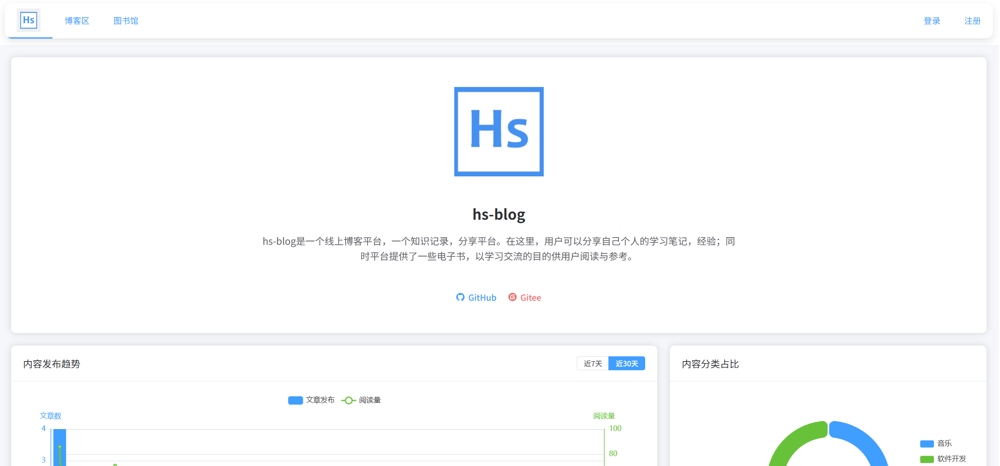

# 

# 从零开始开发项目

首先，我先感谢愿意看我详细讲解项目的朋友们，如果你觉得这是一个不错的项目，或者以下的教程有哪些地方帮助到了你，希望你能够不吝给我点一个star，你的star是对我的最大鼓励！

## 软件开发流程

在项目开始之前，我们应该先复习回顾一下软件工程导论，了解一个项目的开发流程应该是怎么样的，这有助于我们从大方向上把握一个项目的方向。

大致来说，软件开发可以分为这么一些流程：**问题定义-> 可行性研究 -> 需求分析 -> 软件设计（总体设计，详细设计） -> 程序编码 -> 测试（单元测试，集成测试） -> 运行上线 -> 维护。接下来会以本项目为例，来说明一下各个流程是怎么进行的。

**1. 问题定义，可行性研究**

首先要确定解决什么问题，并且有什么样的解决方法能行得通的？本项目是一个集合博客功能的知识记录，分享平台，旨在通过实战项目提高编程水平，并且可以通过这个博客系统记录自己的学习历程。可行性方面在编程角度是完全可行的。

**2. 需求分析**

为了搭建一个知识记录，分享平台，系统应该做什么，要确定系统必须具备哪些功能。

本项目分为供管理员管理的管理端和用户使用的客户端。管理员可以通过管理端对用户账号进行管理，用户发布的博客进行管理，同时上传图书信息等功能。用户可以通过平台发布自己的博客，并且下载图书进行学习交流。

**管理员端：**

* 管理员登录
* 博客的查询，审核，锁定，删除
* 博客分类的增删改查。
* 图书的增删改查。
* 图书分类的增删改查。

**客户端：**

* 访客可以注册登录
* 用户可以写博客，查询博客，收藏博客，博客评论（待完成）
* 关注博主，获取关注博主的文章
* 查询图书，下载图书，加入我的书架

从上面这些点来看，我们能大概了解到两个平台应该完成什么事情。

**3. 软件设计，程序编码**

本项目是一个线上网站，使用前后端分离模式开发，前端使用Vue3+ElementPlus，后端使用Springboot+MybatisPlus+mysql。各个模块的详细设计与编码会在后面的讲解中详细分享。

**4. 测试与上线**

**（待补充）**

# 项目详细搭建过程

在这部分开始，作者会尽力详细的描述这个项目是如何搭建的，如果你从中受到了启发，得到了帮助，请点个star支持我！

## 前端初始搭建

前端总的来看应该包含两个平台，一是提供给管理者使用的后台管理系统页面，二是用户使用的客户端页面。因此，在新建项目的时候我们要建立两个前端项目，以作者本人创建的项目为例，后台管理系统是​**hs-blog-admin-vue​**，客户端是**hs-blog-user-vue**。但不管是客户端还是后台，他们在一开始的搭建步骤都是相似的。大家可以根据自己的喜好来选择IDE，作者使用的是WebStrom。另外的选择还有像VSCode，或者前后端干脆都使用IDEA也是可以的。

### 新建一个项目

打开webStorm，新建project

位置要选择在一个新建的文件夹，如图是新建完成后的项目目录

查看当前node版本，如果不是22则用命令 nvm use 22

然后在Terminal中执行以下命令

```plain
npm install
npm install vue-router@4
```

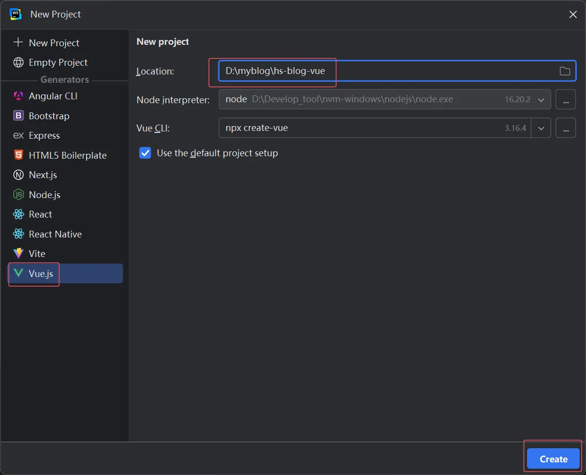

执行完成以后，点击右上角运行按钮或者打开Terminal输入npm run dev,如果出现vue的默认页面，就说明项目新建成功了

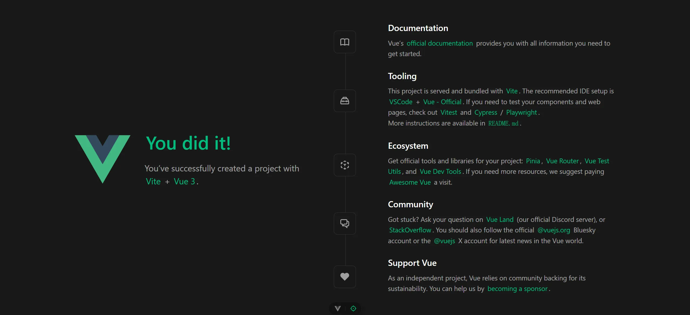

### 删除某些文件以及新建一些文件

删除如.gitignore, .vscode这些文件（夹），以及components中的文件夹

并按照以下目录新建router，view文件夹以及里面的文件

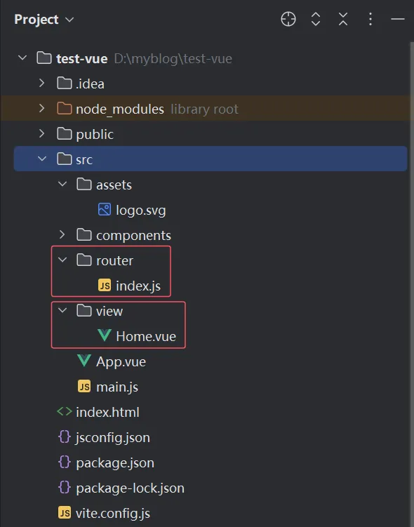

### 修改文件代码

将对应文件的代码修改为以下的代码

修改完成以后重启项目，用浏览器访问localhost:5174应该可以看到如下页面

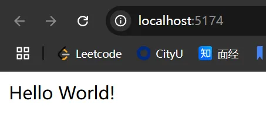

##### src/router/index.js

```plain
import { createRouter, createWebHistory } from 'vue-router'

const router = createRouter({
    history: createWebHistory(import.meta.env.BASE_URL),
    routes: [
        {
            path: '/',
            name: 'home',
            component: ()=>import( '../view/Home.vue'),
        }
    ]
})

export default router
```

##### src/view/Home.vue

```plain
<template>
  <div>
      Hello World!
  </div>
</template>
<script setup>

</script>
```

##### src/App.vue

```plain
<template>
  <RouterView />
</template>
```

##### src/main.js

```plain
import { createApp } from 'vue'
import App from './App.vue'
import router from './router'

const app = createApp(App)
app.use(router)
app.mount('#app')
```

## 后端初始搭建

作者使用的IDE是IDEA，虽然现在用Eclipse的朋友应该没有多少了，但作者还是想对这些朋友们提一句，不妨来试试用IDEA，使用体验会比Eclipse好上许多。

后端搭建分为几个步骤，新建项目，引入依赖，创建项目包结构，修改自己的配置文件数据，初始化mysql，redis，请看以下部分详细讲解。

### 新建项目并引入依赖

新建项目选择Maven依赖，Springboot版本要选择3+
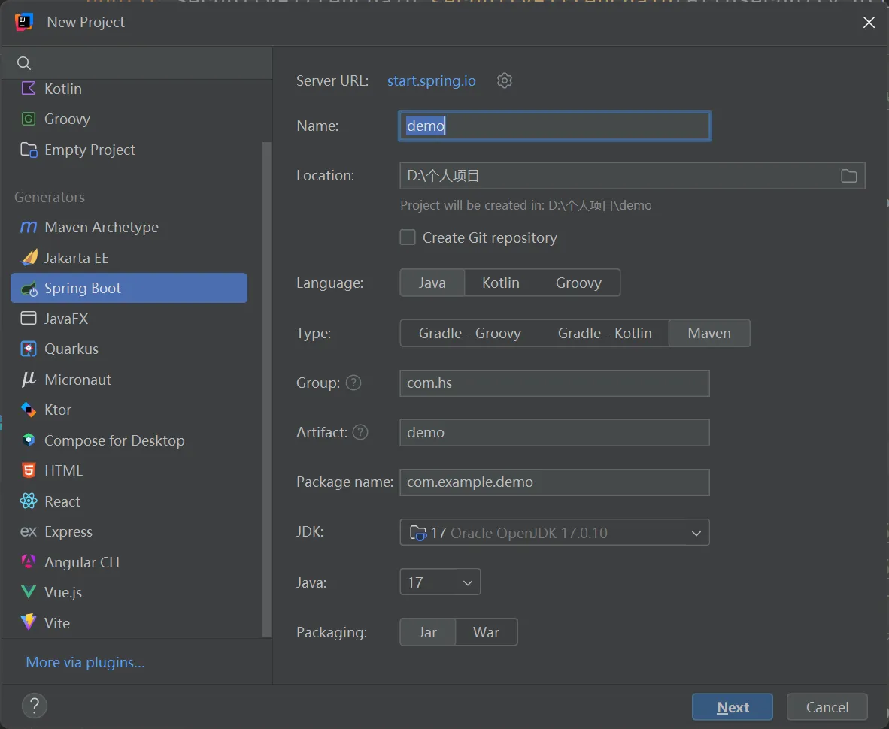
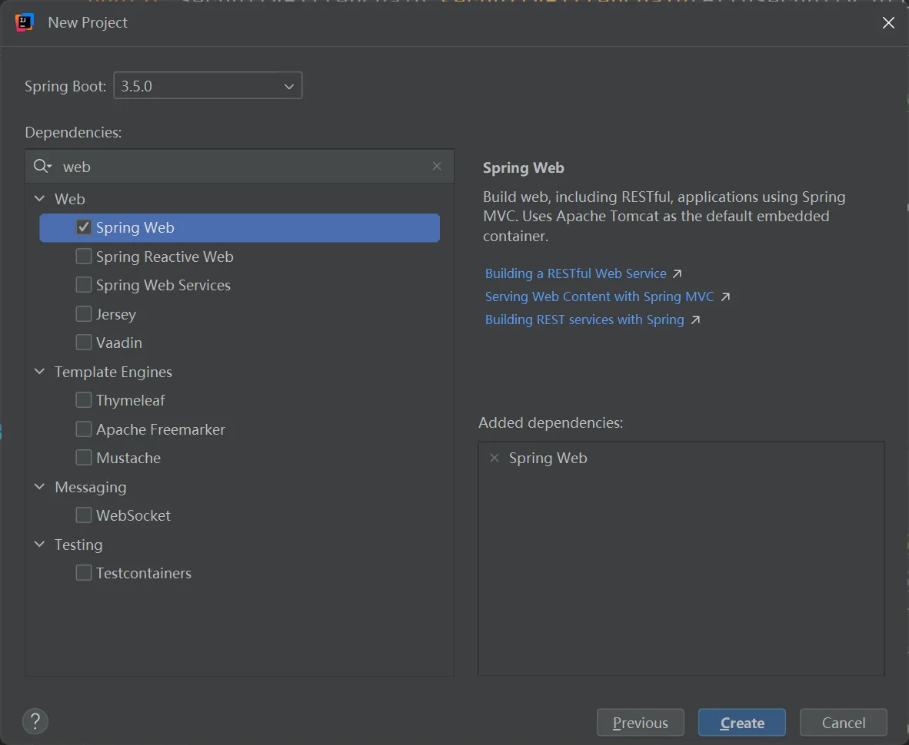

然后复制以下依赖到pom.xml文件中

```plain
<dependencies>
        <dependency>
            <groupId>org.springframework.boot</groupId>
            <artifactId>spring-boot-starter-web</artifactId>
        </dependency>
        <dependency>
            <groupId>com.mysql</groupId>
            <artifactId>mysql-connector-j</artifactId>
            <scope>runtime</scope>
        </dependency>
        <dependency>
            <groupId>org.projectlombok</groupId>
            <artifactId>lombok</artifactId>
            <version>1.18.22</version>
            <scope>provided</scope>
        </dependency>
        <dependency>
            <groupId>org.springframework.boot</groupId>
            <artifactId>spring-boot-starter-test</artifactId>
            <scope>test</scope>
        </dependency>
        <dependency>
            <groupId>com.baomidou</groupId>
            <artifactId>mybatis-plus-spring-boot3-starter</artifactId>
            <version>3.5.11</version>
        </dependency>
        <dependency>
            <groupId>com.baomidou</groupId>
            <artifactId>mybatis-plus-jsqlparser</artifactId>
            <version>3.5.9</version>
        </dependency>
        <dependency>
            <groupId>org.projectlombok</groupId>
            <artifactId>lombok</artifactId>
            <version>1.18.36</version>
            <scope>provided</scope>
        </dependency>
        <dependency>
            <groupId>javax.xml.bind</groupId>
            <artifactId>jaxb-api</artifactId>
            <version>2.3.1</version>
        </dependency>
        <dependency>
            <groupId>com.sun.xml.bind</groupId>
            <artifactId>jaxb-impl</artifactId>
            <version>2.3.1</version>
        </dependency>
        <dependency>
            <groupId>com.sun.xml.bind</groupId>
            <artifactId>jaxb-core</artifactId>
            <version>2.3.0</version>
        </dependency>
        <dependency>
            <groupId>io.jsonwebtoken</groupId>
            <artifactId>jjwt-api</artifactId>
            <version>0.11.5</version>
        </dependency>
        <dependency>
            <groupId>io.jsonwebtoken</groupId>
            <artifactId>jjwt-impl</artifactId>
            <version>0.11.5</version>
            <scope>runtime</scope>
        </dependency>
        <dependency>
            <groupId>io.jsonwebtoken</groupId>
            <artifactId>jjwt-jackson</artifactId>
            <version>0.11.5</version>
            <scope>runtime</scope>
        </dependency>
        <dependency>
            <groupId>junit</groupId>
            <artifactId>junit</artifactId>
        </dependency>
        <dependency>
            <groupId>junit</groupId>
            <artifactId>junit</artifactId>
        </dependency>
        <dependency>
            <groupId>org.testng</groupId>
            <artifactId>testng</artifactId>
            <version>RELEASE</version>
            <scope>compile</scope>
        </dependency>
        <!-- Knife4j 核心依赖 -->
<!--        <dependency>-->
<!--            <groupId>com.github.xiaoymin</groupId>-->
<!--            <artifactId>knife4j-spring-boot-starter</artifactId>-->
<!--            <version>3.0.3</version>-->
<!--        </dependency>-->
        <!-- Spring Boot 3.x + OpenAPI 3.x -->
        <dependency>
            <groupId>com.github.xiaoymin</groupId>
            <artifactId>knife4j-openapi3-jakarta-spring-boot-starter</artifactId>
            <version>4.5.0</version>
        </dependency>
        <!-- Swagger 3 核心依赖 -->
        <dependency>
            <groupId>io.springfox</groupId>
            <artifactId>springfox-swagger2</artifactId>
            <version>3.0.0</version>
        </dependency>
        <!--  Hutool工具包  -->
        <dependency>
            <groupId>cn.hutool</groupId>
            <artifactId>hutool-all</artifactId>
            <version>5.8.16</version>
        </dependency>

        <!-- 阿里云OSS SDK -->
        <dependency>
            <groupId>com.aliyun.oss</groupId>
            <artifactId>aliyun-sdk-oss</artifactId>
            <version>3.15.1</version>
        </dependency>
        <dependency>
            <groupId>com.aliyun</groupId>
            <artifactId>aliyun-java-sdk-core</artifactId>
            <version>4.6.3</version>
        </dependency>
        <!--   Redis   -->
        <dependency>
            <groupId>org.springframework.boot</groupId>
            <artifactId>spring-boot-starter-data-redis</artifactId>
        </dependency>
        <!--   mail   -->
        <dependency>
            <groupId>org.springframework.boot</groupId>
            <artifactId>spring-boot-starter-mail</artifactId>
        </dependency>
        <!--  security  -->
        <dependency>
            <groupId>org.springframework.boot</groupId>
            <artifactId>spring-boot-starter-security</artifactId>
        </dependency>
    </dependencies>
```

### 新建包，修改配置文件

新建包，你可以根据自己的需求与规范来创建包。 我在项目中创建的包如下，除了sql包以外，其他你也可以参考以下的目录新建。

* controller包下我又细分为3个包：admin，user，common，管理员端的接口我统一放在admin包下，客户端接口放在了user包下，一些通用的例如文件上传接口，就放在common中。
* config包主要存放配置文件，如MyBatisPlusConfig，RedisConfig等。
* constant主要存放常量类，MessageConstant。
* context中的CustomUserDetails和filter中的类是与SpringSecurity一起使用的，后续会专门讲解。
* handle包中BlogViewEventHandler的作用：当博客被浏览时，会发布一个BlogViewEvent事件，BlogViewEventHandler监听该事件，并通过异步方式增加对应博客的浏览次数。这种设计方式实现了事件驱动和异步处理，有助于提高系统的性能和响应速度。
* pojo包中是实体类，DTO类，VO类，另外的event包下是一个简单的pojo类，他与博客浏览时监听事件有关。
* properties是配置类，其中AliyunOSSProperties从application.yml中读取配置，然后提供给utils包下AliyunOSSUtil工具类使用，用于初始化OSS客户端。此类存在的作用是将敏感配置集中管理，便于维护，通过类型安全的配置类访问配置，避免硬编码
* result包下是封装的结果类，Result是接口的统一返回结果类。
* utils是工具类，包括JWT，阿里云OSS工具类等。

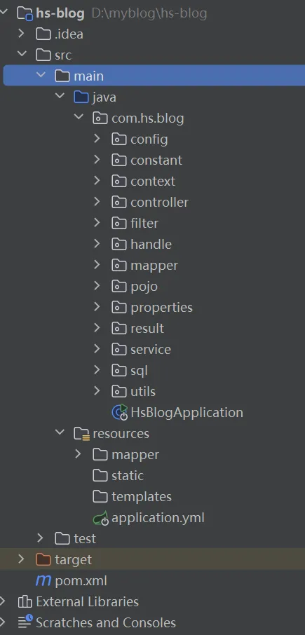

以下是application.yml内容，请手动修改这些地方：你的mysql用户和密码、host，Redis密码、host，QQ邮箱与授权码，阿里云OSS的信息。

```plain
server:
  port: 8080
spring:
  application:
    name: hs-blog
  datasource:
    driver-class-name: com.mysql.cj.jdbc.Driver
    url: jdbc:mysql://localhost:3306/hs-blog?useSSL=false&serverTimezone=UTC&allowPublicKeyRetrieval=true
    username: root
    password: 123456
  servlet:
    multipart:
      # 文件上传大小限制配置
      max-file-size: 10MB
      max-request-size: 10MB
  # Redis配置
  redis:
    client:
      host: localhost          # Redis 服务器地址
      port: 6379               # Redis 端口
      password:
      timeout: 2000            # 连接超时时间（毫秒）
      database: 0              # 使用的 Redis 数据库索引（默认 0）
  # 邮箱信息配置
  mail:
    host: smtp.qq.com          # SMTP 服务器地址
    port: 465                  # SSL 端口
    username: # 你的QQ邮箱      # 发件邮箱
    password: # 你的邮箱授权码  # 邮箱授权码（非邮箱密码）
    protocol: smtps            # 使用SMTP over SSL
    properties:
      mail:
        smtp:
          ssl:
            enable: true        # 启用SSL加密
          auth: true           # 启用认证
          connectiontimeout: 5000  # 连接超时时间(毫秒)
          timeout: 3000        # 读写超时时间(毫秒)
          writetimeout: 5000   # 写超时时间(毫秒)
# MyBatis-Plus 配置
mybatis-plus:
  mapper-locations: classpath*:/mapper/**/*.xml  # XML 文件位置
  type-aliases-package: com.example.entity        # 实体类包路径
  configuration:
    map-underscore-to-camel-case: true            # 开启驼峰命名转换
    log-impl: org.apache.ibatis.logging.stdout.StdOutImpl  # 打印 SQL 日志
  global-config:
    db-config:
      logic-delete-field: isDeleted  # 逻辑删除字段名（需与实体类字段对应）
      logic-delete-value: 1          # 逻辑删除时该字段的值
      logic-not-delete-value: 0      # 未删除时该字段的值
aliyun:
  oss:
    endpoint: #请填写
    access-key-id: #请填写
    access-key-secret: #请填写
    bucket-name: #请填写
```

### 数据库初始化

**在此步骤中，你可以使用其他可视化工具如Navicat, SQLyog等，同时你也可以尝试下IDEA自带的，请看以下的操作。**

#### 在IDEA中连接数据库，运行SQL脚本

**在IDEA右侧找到DB，选择添加数据源，找到MySQL**

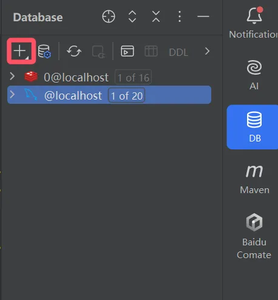
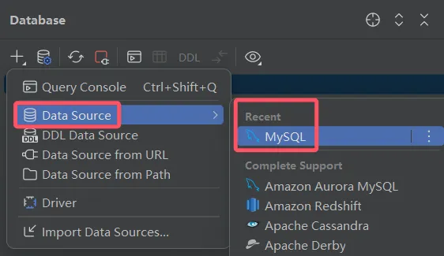

输入你自己的账号密码，Test connection如果通过则直接进行连接
User: root
Password: 123456

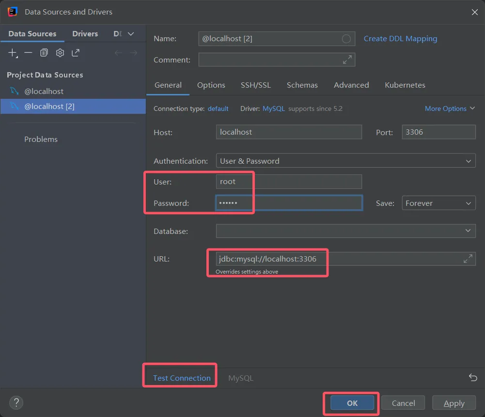

右击数据源，运行SQL脚本，脚本位置在sql包下，即之前创建包时提到过的。

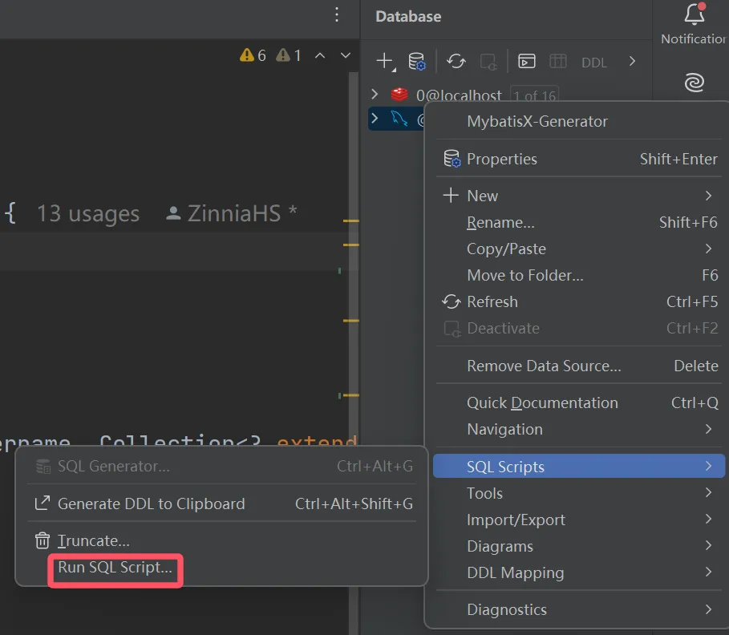

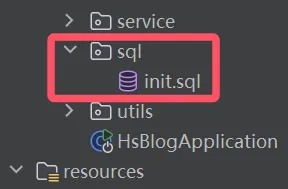

等待脚本运行完成以后，先点击数据源旁边的位置

选择刚刚新建的新数据库，此项目是hs-blog，打钩展示出来

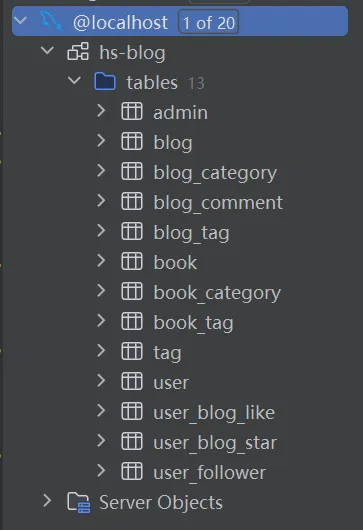

#### 提醒：记得修改项目applicaiton.yml文件配置

找到yml文件配置mysql的账号密码。

#### Redis配置

与mysql是同样的操作，在右侧DB中找到Redis数据源添加。
然后输入你的密码连接，由于我没有设置密码所以是空的。
记得在applicaiton.yml也要修改。

# 

## 数据库设计

首先是用户表，管理员表，记录了两个角色各自的基本信息包括用户名密码等...

但关于用户表，权限之间的设计有一种更好的设计方式，有兴趣的朋友可以参考本节最后部分。本项目中简化了这些设计，只把使用者分为两类，管理者和用户，简单的设计了数据表。

博客表记录博客的基本信息，标题，副标题，作者，内容等...

图书表记录图书基本信息，标题内容等...

结合前面需求分析阶段，可以初步设计如下数据库表

**(此处图片待补充)**

### 管理员表

* 首先是自增的主键：管理员id
* 管理员的账号和密码
* 创建时间，更新时间

```sql
CREATE TABLE `admin` (
  `id` int NOT NULL AUTO_INCREMENT COMMENT '主键ID',
  `username` varchar(50) NOT NULL COMMENT '管理员账号（唯一）',
  `password` varchar(100) NOT NULL COMMENT '加密后的密码（推荐BCrypt加密）',
  `create_time` datetime DEFAULT CURRENT_TIMESTAMP COMMENT '创建时间（自动填充）',
  `update_time` datetime DEFAULT NULL ON UPDATE CURRENT_TIMESTAMP COMMENT '更新时间（自动更新）',
  `is_deleted` tinyint DEFAULT '0',
  PRIMARY KEY (`id`),
  UNIQUE KEY `username` (`username`)
) ENGINE=InnoDB DEFAULT CHARSET=utf8mb4 COLLATE=utf8mb4_0900_ai_ci COMMENT='管理员信息表';
```

### 用户表

* 主键为自增的用户id
* 用户账号密码
* 用户的邮箱
* 头像URL
* 电话
* 锁定状态
* 注册时间，更新时间

```sql
CREATE TABLE `user` (
  `id` int NOT NULL AUTO_INCREMENT COMMENT '主键ID',
  `username` varchar(50) DEFAULT (`email`) COMMENT '用户账号',
  `password` varchar(100) NOT NULL COMMENT '加密后的密码',
  `email` varchar(100) NOT NULL COMMENT '邮箱地址（唯一）',
  `avatar_url` varchar(200) DEFAULT 'https://picsum.photos/seed/picsum/200/300' COMMENT '头像图片URL',
  `description` varchar(200) DEFAULT NULL COMMENT '个人签名',
  `phone` varchar(20) DEFAULT NULL COMMENT '联系电话',
  `lock_status` int DEFAULT '0' COMMENT '锁定状态（未锁定：0，锁定：1）',
  `create_time` datetime DEFAULT CURRENT_TIMESTAMP COMMENT '注册时间',
  `update_time` datetime DEFAULT NULL ON UPDATE CURRENT_TIMESTAMP COMMENT '最后更新时间',
  `is_deleted` tinyint DEFAULT '0',
  PRIMARY KEY (`id`),
  UNIQUE KEY `email` (`email`),
  UNIQUE KEY `username` (`username`)
) ENGINE=InnoDB AUTO_INCREMENT=4 DEFAULT CHARSET=utf8mb4 COLLATE=utf8mb4_0900_ai_ci COMMENT='用户信息表';
```

### 博客表

* 自增的博客id
* 标题，博客内容
* 博客作者id
* 分类id
* 博客状态（草稿/已发布）
* 锁定状态
* 浏览量
* 博客点赞数
* 博客创建时间，更新时间

这里说一下分类id，每一篇博客需要被分类为一个具体的类别下，例如：

这篇学习贴被分类在：编程学习类别 => Java类别下

```sql
CREATE TABLE `blog` (
  `id` bigint NOT NULL AUTO_INCREMENT COMMENT '主键ID',
  `title` varchar(200) NOT NULL COMMENT '博客标题',
  `sub_title` varchar(200) DEFAULT NULL COMMENT '副标题',
  `content` longtext NOT NULL COMMENT '博客内容（支持Markdown格式）',
  `user_id` int NOT NULL COMMENT '用户ID',
  `category_id` int DEFAULT NULL COMMENT '分类ID',
  `status` int DEFAULT '0' COMMENT '状态：草稿0/已发布1',
  `lock_status` int DEFAULT '0' COMMENT '锁定状态',
  `view_count` int DEFAULT '0' COMMENT '浏览次数',
  `like_count` int DEFAULT '0' COMMENT '点赞数量',
  `star_count` int DEFAULT '0' COMMENT '收藏数量',
  `create_time` datetime DEFAULT CURRENT_TIMESTAMP COMMENT '创建时间',
  `update_time` datetime DEFAULT NULL ON UPDATE CURRENT_TIMESTAMP COMMENT '更新时间',
  `is_deleted` tinyint DEFAULT '0',
  PRIMARY KEY (`id`),
  KEY `author_id` (`user_id`),
  KEY `category_id` (`category_id`),
  CONSTRAINT `blog_ibfk_1` FOREIGN KEY (`user_id`) REFERENCES `user` (`id`),
  CONSTRAINT `blog_ibfk_2` FOREIGN KEY (`category_id`) REFERENCES `blog_category` (`id`)
) ENGINE=InnoDB AUTO_INCREMENT=16 DEFAULT CHARSET=utf8mb4 COLLATE=utf8mb4_0900_ai_ci COMMENT='知识博客表';
```

### 图书表

**图书的分类参考以下：豆瓣阅读的分类方式**

[https://read.douban.com/ebooks/?dcs=book-nav&dcm=douban](https://read.douban.com/ebooks/?dcs=book-nav&dcm=douban)

**ISBN，作者，出版社等信息可以通过以下查询：Z-LIB，豆瓣读书**

[https://search.douban.com/book/subject\_search?search\_text=java&cat=1001](https://search.douban.com/book/subject_search?search_text=java&cat=1001)

[https://zh.1lib.su/s/%E6%B7%B1%E5%85%A5%E7%90%86%E8%A7%A3java%E8%99%9A%E6%8B%9F%E6%9C%BA?content\_type=book](https://zh.1lib.su/s/%E6%B7%B1%E5%85%A5%E7%90%86%E8%A7%A3java%E8%99%9A%E6%8B%9F%E6%9C%BA?content_type=book)

* 图书主键id
* ISBN号（以ISBN13为准）
* 图书名称
* 作者
* 出版社
* 出版日期
* 封面图片URL
* 电子书存储路径
* 图书简介
* 分类id
* 书籍状态（0：下架；1：上架）
* 浏览次数？下载次数？
* 上传时间，更新时间

```sql
CREATE TABLE `book` (
  `id` bigint NOT NULL AUTO_INCREMENT COMMENT '主键ID',
  `isbn` varchar(20) NOT NULL COMMENT '国际标准书号',
  `title` varchar(200) NOT NULL COMMENT '图书标题',
  `author` varchar(100) NOT NULL COMMENT '作者/编者',
  `publisher` varchar(100) DEFAULT NULL COMMENT '出版社',
  `publish_date` date DEFAULT NULL COMMENT '出版日期',
  `cover_url` varchar(200) DEFAULT NULL COMMENT '封面图片URL',
  `file_path` varchar(200) DEFAULT NULL COMMENT '电子书存储路径（相对路径）',
  `description` text COMMENT '图书简介',
  `download_count` int DEFAULT '0' COMMENT '下载次数',
  `create_time` datetime DEFAULT CURRENT_TIMESTAMP COMMENT '上传时间',
  `update_time` datetime DEFAULT NULL ON UPDATE CURRENT_TIMESTAMP COMMENT '更新时间',
  `category_id` int DEFAULT NULL COMMENT '分类ID',
  `status` int DEFAULT '1' COMMENT '书籍状态（0：下架；1：上架）',
  `is_deleted` tinyint DEFAULT '0',
  PRIMARY KEY (`id`),
  UNIQUE KEY `isbn` (`isbn`),
  KEY `book_book_category_id_fk` (`category_id`),
  CONSTRAINT `book_book_category_id_fk` FOREIGN KEY (`category_id`) REFERENCES `book_category` (`id`)
) ENGINE=InnoDB AUTO_INCREMENT=31 DEFAULT CHARSET=utf8mb4 COLLATE=utf8mb4_0900_ai_ci COMMENT='电子图书表';
```

### 博客分类表

* 类型id
* 分类名称
* 父分类id

存在父类别和子类别，例如编程学习是顶级分类则没有parent\_id，编程学习类别下的Java类别则拥有parent\_id为编程学习类别的id

编程学习类别 => Java类别

```sql
CREATE TABLE `blog_category` (
  `id` int NOT NULL AUTO_INCREMENT COMMENT '主键ID',
  `name` varchar(50) NOT NULL COMMENT '分类名称',
  `parent_id` int DEFAULT NULL COMMENT '父分类ID（顶级分类为NULL）',
  `create_time` datetime DEFAULT (now()) COMMENT '创建时间',
  `update_time` datetime DEFAULT NULL ON UPDATE CURRENT_TIMESTAMP,
  PRIMARY KEY (`id`),
  KEY `parent_id` (`parent_id`),
  CONSTRAINT `blog_category_ibfk_1` FOREIGN KEY (`parent_id`) REFERENCES `blog_category` (`id`)
) ENGINE=InnoDB AUTO_INCREMENT=7 DEFAULT CHARSET=utf8mb4 COLLATE=utf8mb4_0900_ai_ci COMMENT='博客分类表';
```

### 图书分类表

* 类型id
* 分类名称
* 父分类id

```sql
CREATE TABLE `book_category` (
`id` int NOT NULL AUTO_INCREMENT COMMENT '主键ID',
`name` varchar(50) NOT NULL COMMENT '分类名称',
`parent_id` int DEFAULT NULL COMMENT '父分类ID（顶级分类为NULL）',
`create_time` datetime DEFAULT (now()) COMMENT '创建时间',
`update_time` datetime DEFAULT NULL ON UPDATE CURRENT_TIMESTAMP COMMENT '更新时间',
PRIMARY KEY (`id`),
KEY `parent_id` (`parent_id`),
CONSTRAINT `book_category_ibfk_1` FOREIGN KEY (`parent_id`) REFERENCES `book_category` (`id`)
) ENGINE=InnoDB AUTO_INCREMENT=95 DEFAULT CHARSET=utf8mb4 COLLATE=utf8mb4_0900_ai_ci COMMENT='图书分类表';
```

### 标签表(暂未使用)

* 标签id
* 标签名称

```sql
CREATE TABLE tag (
    id INT PRIMARY KEY AUTO_INCREMENT COMMENT '主键ID',
    name VARCHAR(50) UNIQUE NOT NULL COMMENT '标签名称（唯一）'
) COMMENT='内容标签表';
```

### 博客标签关联表(暂未使用)

* 博客id
* 标签id

博客与标签是多对多的关系，一条博客可能对应多个标签，多个博客可能对应一个标签

所以我们要建立中间表

```sql
CREATE TABLE blog_tag (
    blog_id BIGINT NOT NULL COMMENT '博客ID',
    tag_id INT NOT NULL COMMENT '标签ID',
    PRIMARY KEY (blog_id, tag_id),
    FOREIGN KEY (blog_id) REFERENCES blog(id),
    FOREIGN KEY (tag_id) REFERENCES tag(id)
) COMMENT='博客与标签关联表';
```

### 图书标签关联表(暂未使用)

```sql
CREATE TABLE book_tag (
    book_id BIGINT NOT NULL COMMENT '图书ID',
    tag_id INT NOT NULL COMMENT '标签ID',
    PRIMARY KEY (book_id, tag_id),
    FOREIGN KEY (book_id) REFERENCES book(id),
    FOREIGN KEY (tag_id) REFERENCES tag(id)
) COMMENT='图书与标签关联表';
```

### 用户关注（粉丝）关联表

```sql
CREATE TABLE `user_follower` (
  `id` int NOT NULL AUTO_INCREMENT COMMENT '主键',
  `user_id` int NOT NULL COMMENT '博主ID',
  `follower_id` int NOT NULL COMMENT '粉丝ID',
  `create_time` datetime DEFAULT CURRENT_TIMESTAMP COMMENT '关注时间',
  PRIMARY KEY (`id`),
  KEY `idx_user_follower` (`user_id`,`follower_id`),
  KEY `fk_user_follower_follower` (`follower_id`),
  CONSTRAINT `fk_user_follower_follower` FOREIGN KEY (`follower_id`) REFERENCES `user` (`id`),
  CONSTRAINT `fk_user_follower_user` FOREIGN KEY (`user_id`) REFERENCES `user` (`id`)
) ENGINE=InnoDB AUTO_INCREMENT=9 DEFAULT CHARSET=utf8mb4 COLLATE=utf8mb4_0900_ai_ci COMMENT='用户关注（粉丝）关系表';
```

### 博客评论表(暂未使用)

* 评论id
* 评论内容
* 评论的用户id
* 该评论关联的博客id
* 评论创建时间，更新时间

```sql
CREATE TABLE blog_comment (
    id BIGINT PRIMARY KEY AUTO_INCREMENT COMMENT '主键ID',
    content TEXT NOT NULL COMMENT '评论内容',
    user_id INT NOT NULL COMMENT '评论人ID',
    blog_id BIGINT NOT NULL COMMENT '关联博客ID', 
    created_time DATETIME DEFAULT CURRENT_TIMESTAMP COMMENT '评论时间',
    updated_time DATETIME ON UPDATE CURRENT_TIMESTAMP COMMENT '更新时间',
) COMMENT='博客评论表';
```

### 用户博客点赞表

```sql
CREATE TABLE `user_blog_like` (
  `user_id` int NOT NULL COMMENT '用户ID',
  `blog_id` bigint NOT NULL COMMENT '博客ID',
  `create_time` datetime DEFAULT CURRENT_TIMESTAMP COMMENT '创建时间',
  `update_time` datetime DEFAULT CURRENT_TIMESTAMP ON UPDATE CURRENT_TIMESTAMP COMMENT '更新时间',
  `is_deleted` tinyint DEFAULT '0' COMMENT '逻辑删除标记（0:未删除 1:已删除）',
  PRIMARY KEY (`user_id`,`blog_id`),
  KEY `blog_id` (`blog_id`),
  CONSTRAINT `user_blog_like_ibfk_1` FOREIGN KEY (`user_id`) REFERENCES `user` (`id`) ON DELETE CASCADE ON UPDATE CASCADE,
  CONSTRAINT `user_blog_like_ibfk_2` FOREIGN KEY (`blog_id`) REFERENCES `blog` (`id`) ON DELETE CASCADE ON UPDATE CASCADE
) ENGINE=InnoDB DEFAULT CHARSET=utf8mb4 COLLATE=utf8mb4_0900_ai_ci COMMENT='用户博客点赞表';
```

### 用户博客收藏表

```sql
CREATE TABLE `user_blog_star` (
  `user_id` int NOT NULL COMMENT '用户ID',
  `blog_id` bigint NOT NULL COMMENT '博客ID',
  `create_time` datetime DEFAULT CURRENT_TIMESTAMP COMMENT '创建时间',
  `update_time` datetime DEFAULT CURRENT_TIMESTAMP ON UPDATE CURRENT_TIMESTAMP COMMENT '更新时间',
  `is_deleted` tinyint DEFAULT '0' COMMENT '逻辑删除标记（0:未删除 1:已删除）',
  PRIMARY KEY (`user_id`,`blog_id`),
  KEY `blog_id` (`blog_id`),
  CONSTRAINT `user_blog_star_ibfk_1` FOREIGN KEY (`user_id`) REFERENCES `user` (`id`) ON DELETE CASCADE ON UPDATE CASCADE,
  CONSTRAINT `user_blog_star_ibfk_2` FOREIGN KEY (`blog_id`) REFERENCES `blog` (`id`) ON DELETE CASCADE ON UPDATE CASCADE
) ENGINE=InnoDB DEFAULT CHARSET=utf8mb4 COLLATE=utf8mb4_0900_ai_ci COMMENT='用户博客收藏表';
```

### 用户图书收藏表

```sql
CREATE TABLE `user_book` (
  `user_id` bigint NOT NULL COMMENT '用户 ID',
  `book_id` bigint NOT NULL COMMENT '图书 ID',
  `create_time` datetime NOT NULL DEFAULT CURRENT_TIMESTAMP COMMENT '创建时间',
  `update_time` datetime NOT NULL DEFAULT CURRENT_TIMESTAMP ON UPDATE CURRENT_TIMESTAMP COMMENT '更新时间',
  PRIMARY KEY (`user_id`,`book_id`),
  KEY `idx_book_id` (`book_id`)
) ENGINE=InnoDB DEFAULT CHARSET=utf8mb4 COLLATE=utf8mb4_0900_ai_ci COMMENT='用户图书收藏表';
```

### 另一种用户-权限设计

一个用户可能会有多种角色，多个用户也可能只对应一个角色。同样的一个角色可能拥有多个权限，多个角色可能只拥有其中一种权限。因此，在用户-角色之间，角色-权限之间都需要建立一个多对多中间表，来描述他们之间的关系。这样下来总共需要创建五张表。

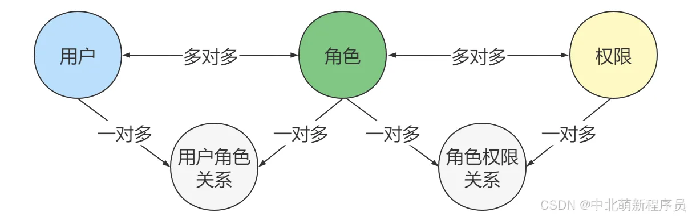

## sql文件导出

右键数据库，选择Export with mysqldump
可以自己改下导出时的名字

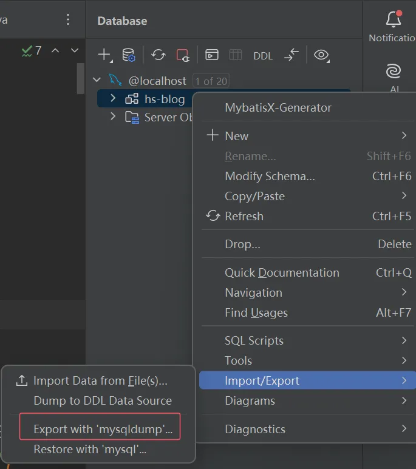
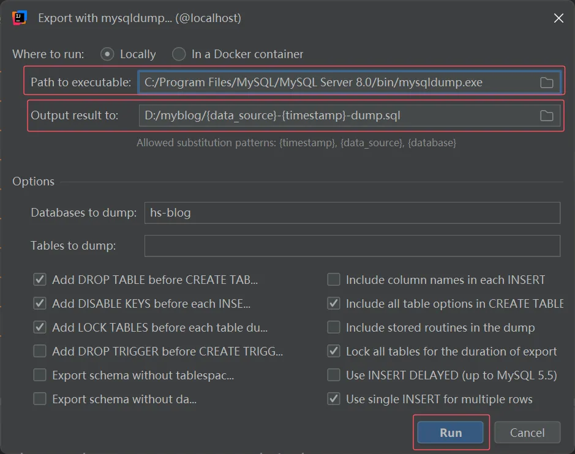

## 查看sql关系图

右键数据库，选择Show Diagram

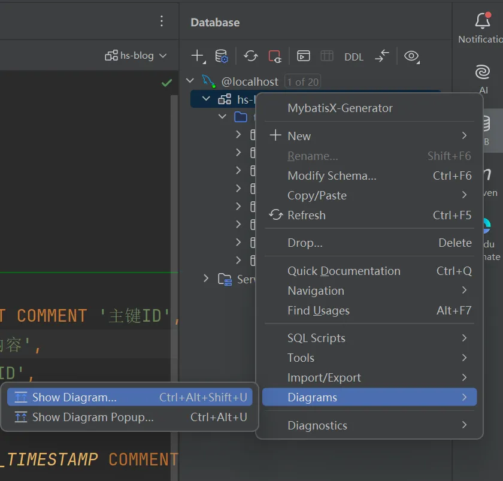
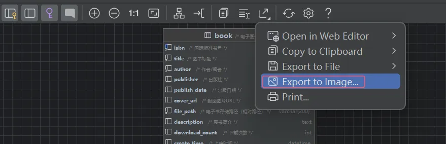

